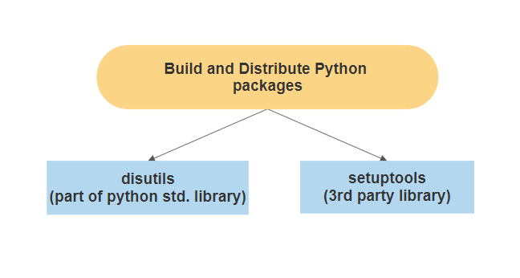
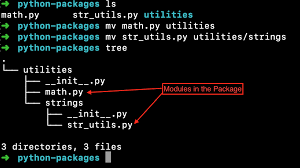
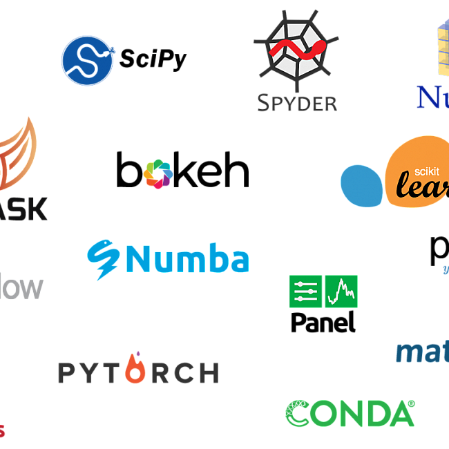
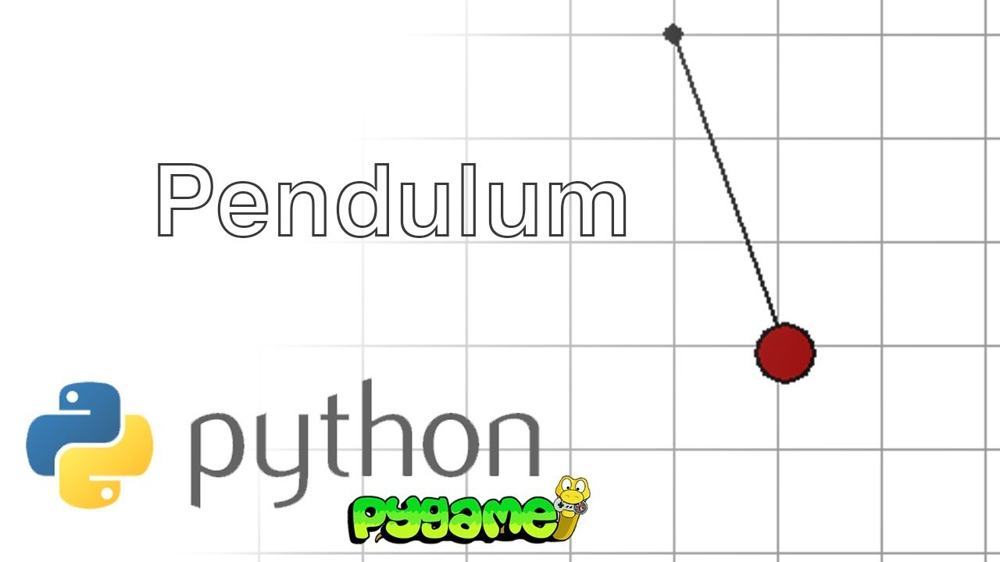

### Python - Packages
### We organize a large number of files in different folders and subfolders based on some criteria, so that we can find and manage them easily. In the same way, a package in Python takes the concept of the modular approach to next logical level. As you know, a module can contain multiple objects, such as classes, functions, etc. A package can contain one or more relevant modules. Physically, a package is actually a folder containing one or more module files.

### SOME OF THE PYTHON PACKAGES:

# SciPy
### SciPy is an open-source Python library which is used to solve scientific and mathematical problems. It is built on the NumPy extension and allows the user to manipulate and visualize data with a wide range of high-level commands. As mentioned earlier, SciPy builds on NumPy and therefore if you import SciPy, there is no need to import NumPy.

### NumPy is the fundamental package for scientific computing in Python. It is a Python library that provides a multidimensional array object, various derived objects (such as masked arrays and matrices), and an assortment of routines for fast operations on arrays, including mathematical, logical, shape manipulation, sorting, selecting, I/O, discrete Fourier transforms, basic linear algebra, basic statistical operations, random simulation and much more.

# Setuptools

### As third-party packages matured, deviation from the standard occured, allowing for greater versatility and functionality in the packages themselves. The officially recommended tool to handle this is setuptools. It maintains all the functionality that distutils established, extends to third-party packages maintained on PyPI, and even those that are not. It works well with pip and other Python installation packages. 

# Pendulum

### Pendulum is designed to be a drop-in replacement for datetime. That means you can use it with code you’ve already written based on datetime. With only a few exceptions, Pendulum will work just as well, without the need to modify the code, while providing extra features not present in plain-old datetime.

 
