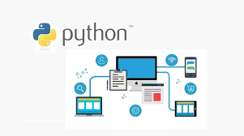
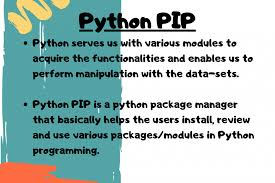
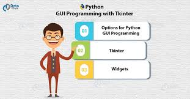
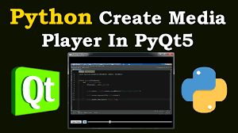
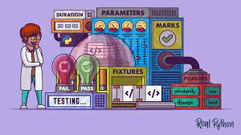

# WHAT IS A PYTHON PACKAGE
#### A python package is a collection of modules. Modules that are related to each other are mainly put in the same package. When a module from an external package is required in a program, that package can be imported and its modules can be put to use.

#### Any Python file, whose name is the module’s name property without the .py extension, is a module.

#### A package is a directory of Python modules that contains an additional __init__.py file, which distinguishes a package from a directory that is supposed to contain multiple Python scripts. Packages can be nested to multiple depths if each corresponding directory contains its own __init__.py file.

# INSTALLING  PACKAGES
#### There are two ways to install packages from PyPI. You can download the package and then run python setup.py install. But the modern way is to use pip, setuptools and wheel. Pip stands for Pip Installs Packages (yes, it's one of those acronyms) and is your front end for installation. If you have Python 2 >=2.7.9 or Python 3 >=3.4 installed from python.org, you will already have pip and setuptools, but will need to upgrade to the latest version: pip install -U pip setuptools or python -m pip install -U pip setuptools on Windows.
#### Use pip to install wheel: pip install wheel
#### Python packages are always installed into an environment. A common practice I will not cover here is to use virtual environments to manage multiple independent installations of Python with different interpreters and/or different sets of installed packages.

# SOME OF THE PYTHON PACKAGES

### 1.TKINTER 

#### If we  want to develop a Python app with a Graphical User Interface (GUI)? There are a variety of packages designed to help you do that (indeed, we could make a top ten list of just Python GUI packages). But I think most Python developers would agree that Tkinter is the most important — and most commonly used — framework for creating GUIs. It binds Python to the TK GUI toolkit, which works on virtually every modern operating system.Unless you have a strong preference for a different GUI toolkit, Tkinter is probably the best place to start when creating a Python GUI.

### 2.  PYQT

#### The preceding sentence notwithstanding, PyQT, another Python package for building GUIs, is also a strong contender. It provides bindings to (you guessed it) the Qt toolkit, which is also cross-platform. It’s intended for heavier-duty GUI programming than Tkinter. That means that PyQT may be overkill if you’re building an app that has a pretty simple interface — say, just a window with some buttons and text fields — but it is a good tool if you want to build a complex, multi-dimensional GUI.

### 3. PYWIN32

#### For Windows Python programming in particular, Pywin32 is a must-have package. It provides access to many of the native Windows API functions, allowing you to do things like interact with the Windows registry, use the Windows clipboard, and much more.Pywin32 won’t do you much good if you’re building a cross-platform Python app, but Windows developers might find that they like it so much that they use it instead of native Windows tooling.

### 4.PYTEST

#### If you have a Python development project of any complexity, being able to perform testing on new code is essential. The Pytest package provides a variety of modules to help you do this. Whether it’s a simple unit test or a more complex functional test, Pytest can help you write it.

# USES OF PACKAGES

#### Use of packages helps importing any modules, individually or whole. While importing a package or sub packages or modules, Python searches the whole tree of directories looking for the particular package and proceeds systematically as programmed by the dot operator.

